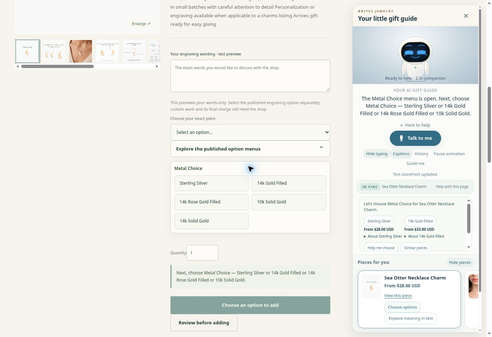
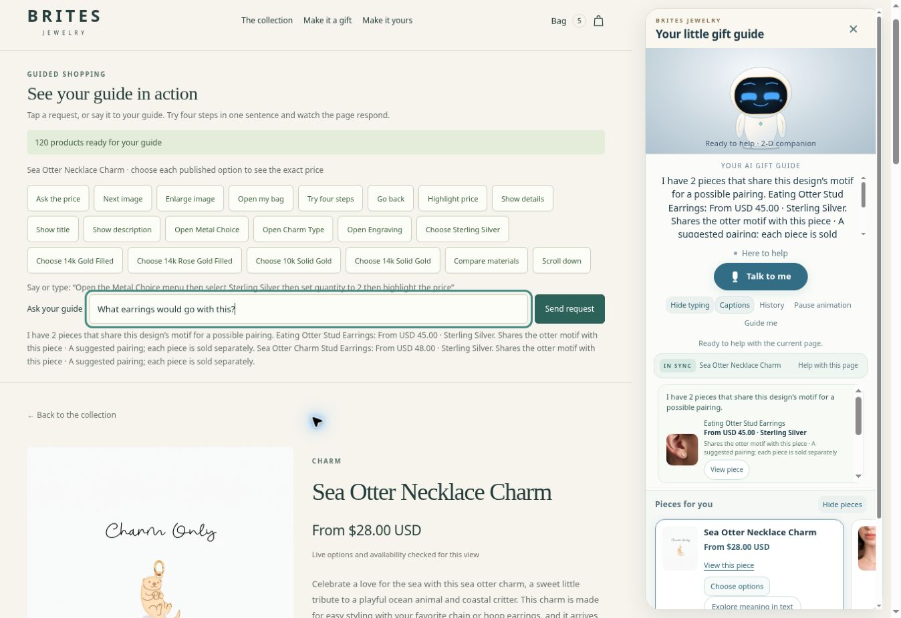
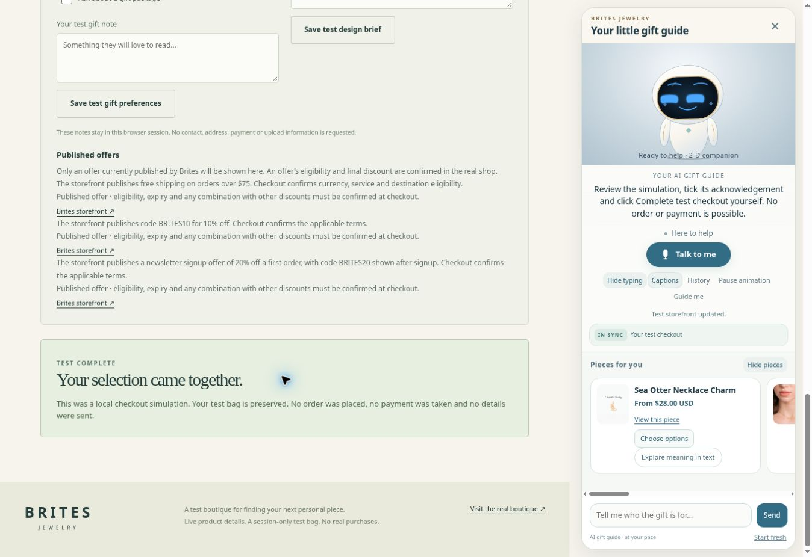

# Brites avatar integration release 43

The five requested improvements are implemented and published in the isolated Brites growth sandbox. All six available subagents—five implementation specialists and an independent adversarial reviewer—reconciled the [64 detailed requirements](avatar-integration-acceptance43.md). The implementation, actual browser evidence and remaining physical/live acceptance are recorded separately. [Shopping-flow research](shopper-flow-research43.md) explains the primary sources and design decisions.

## Delivered behavior

- Calm, balanced thinking eyes and brows, a soft smile, four finite request-bound waiting variations and irregular blinks. Result, uncertainty and supportive cues remain restrained; pause, hidden-state and reduced-motion handling retire old animation.
- Shared checked catalogue taxonomy understands butterfly and animal earrings, jewellery types, synonyms, corrections, negation, material and item-budget refinements. One available exact variant must satisfy material and price together; currencies are never converted silently.
- The guide follows manual and assistant navigation, exact current product, options, selected variant, quantity, gallery, bag and checkout. Current detail outranks stale discovery or hover. Missing dimensions are acknowledged rather than invented. Descriptions and approved knowledge provide grounded facts and story information.
- Choice assistance opens the real required menu, offers qualified material advice with native prices, preserves earlier axes and progresses to the next choice. A recommendation never selects an option automatically. Direct Add and explicit Review retain separate authority, fresh stock/price/hold checks and exact cart readback.
- Prepared alternatives and pairings use checked current motifs, explain the match, retain current controls and bag, and respect dismissal, negative preferences and exhausted results. A pairing is labelled as separately sold pieces; it is not presented as an official bundle.
- The sandbox supports stable-line quantity changes, removal and undo, session persistence and a complete labelled checkout simulation. Final test completion requires the visible acknowledgement and actual button activation.
- The opt-in production Shopify adapter, bridge, migration and snippet assets are integrated and regression-tested. The live theme has not been installed or modified by this release.

## Actual browser findings and their final outcomes

The first publication was source `da870088d67a9e99850c0cd9e278d6cd4cee1241`, ready deploy `6ac820c52dcc1900070c7aa1`. Actual browser review found seven gaps beyond its passing initial fixtures. Each became a literal regression case; the failure history remains in the [browser evidence](avatar43-browser-evidence.json).

| Observed request or layout | First-publication failure | Final correction and actual result |
| --- | --- | --- |
| What size is this piece? | A metal-only listing answered with metal values. | Generic size reports missing physical measurements honestly and labels any published size/length axes separately. S1 Butterfly and S2 Sea Otter answers state that exact measurements are not confirmed. |
| What am I looking at? | An open listing fell back to an earlier animal search. | Current identity outranks old discovery. S1 manually entered Butterfly and S2 Sea Otter/Eating Otter answer the exact checked current title and description without changing selection or bag. |
| Add this exact piece to my cart | A complete exact selection was rejected unnecessarily. | Narrow current-reference grammar preserves all target/variant/quantity guards. S1 added exactly two USD48 Silver Butterfly earrings, USD96 subtotal, changing bag 3 to 5 once; cart retained the separate earlier quantity-3 line. |
| More like this | A supported deictic phrase fell back remotely. | Current alternatives remain local. S1 reported honest motif exhaustion and rejection without losing Silver, quantity 2 or bag. |
| Show me all pieces | Six assistant overview cards replaced full host browse/paging. | Explicit all restores actual full host browsing. S1 showed 120 checked identities and native paging 24 to 48; S2 restored 120 with 24 cards and preserved bag 5. Ordinary overview remains concise. |
| Matching earrings from Sea Otter Necklace Charm | Ordinary charms were treated as blocked components; after the first correction, an inherited positive butterfly interest still vetoed the current otter motif. | Ordinary charms retain the verified existing contract; exact current motif outranks positive historical themes only for an exact match. Explicit negative/material/budget/currency/stock/hold guards remain strict. S2 in the original conversation suggested Eating Otter Stud Earrings USD45 and Sea Otter Charm Stud Earrings USD48, both Sterling Silver and separately sold, preserving the unselected current piece, quantity 1 and bag 5. |
| Open options at 360 × 720 | The full guide covered the native menu. | Compact assistance exposes the actual controls. S2 panel top 323.20px/height 388.80px; all three native Metal choices end at or above 222.14px and pass DOM hit checks. Input is 16px/44px high; no horizontal overflow. S1 exact Silver/8.5mm selection/add and menu-close restoration passed with keyboard. Physical touch remains unverified. |

S2 additionally completed a three-axis Sea Otter walkthrough: Metal Choice → Sterling Silver; Charm Type → Necklace Charm; Engraving → No. Each real menu opened in turn and retained earlier choices. The exact USD28/quantity-1 selection became ready without a cart write. Its literal identity, unknown-size and selected-price answers preserved those controls. Keyboard activation of the actual Eating Otter recommendation opened that listing; the guide identified it correctly. Go back restored the exact Sea Otter Silver/Necklace Charm/No selection and bag 5.

## Browser cart, checkout and rendering evidence

The initial actual desktop run opened missing options without adding, chose Silver and quantity 2, added the exact USD96 line, navigated to the bag, changed quantity to 3/USD144, removed and restored the same line, and retained bag/route after a settled reload. S1 retested the corrected exact-add wording and cart navigation. Its checkout initially refused fresh public reads while preserving bag 5. Earlier browser HTTP status and cause were unobserved. The correct `butterfly-cutout-stud-earrings-4` endpoint later confirmed the same available USD48 Silver variant; a meaningful retry reached the exact checkout. No price drift was established.

The observed checkout reviewed the two separate quantity-3/USD144 and quantity-2/USD96 lines, selected the labelled Demo express interface option and reached confirmation. A completion command alone left acknowledgement unchecked and completion disabled. Only explicit checkbox and button activation produced TEST COMPLETE and the local receipt. The bag stayed at 5. No real order, payment, contact, address or message was submitted. S2 changes only the guide matching module relative to S1; the host, controller, bridge and compact CSS exercised by the S1 cart/checkout remain byte-identical.

The browser used the actual production animated SVG fallback because WebGL was unavailable. The replacement thinking pose was inspected at full and widget size; later geometry changed, pause retained the face and listening transition was observed. Reduced-motion source invariants passed but visible trajectory coverage was sparse. The memorial-support fixture used authored amplitude/spectrum with zero provider or microphone calls. These observations establish fallback rendering and bounded code behavior, not GPU appearance, FPS, native speech quality or subjective shopper approval.

| Screenshot | Observed source/deploy | What it establishes |
| --- | --- | --- |
| [Current-motif pairing](avatar43-pairing.jpg) | S2 `20549c85` / `6ac82eff2a43000008726770` | Current Sea Otter context, actual pairing answer/card and preserved bag 5 |
| [Real option menu](avatar43-options.jpg) | S2 `20549c85` / same deploy | All five native Metal choices, no implicit selection, priced Silver/Gold Filled guidance |
| [Narrow option assistance](avatar43-mobile.jpg) | S2 `20549c85` / same deploy | Actual 360 × 720 frame, native controls above compact guide, visible composer |
| [Exact cart](avatar43-cart.jpg) | S1 `346497b3` / `6ac82b26a7a21300079f8497` | Bag 5 with distinct exact Silver lines |
| [Explicit test completion](avatar43-checkout.jpg) | S1 `346497b3` / same S1 deploy | Local TEST COMPLETE receipt; no order/payment/details sent |
| [Friendly thinking fallback](avatar43-thinking.jpg) | S0 `da870088` / `6ac820c52dcc1900070c7aa1` | Rendered replacement SVG thinking expression; face source is unchanged in S2 |

## Final source, publication and checks

The final tested source is `20549c85190634b3e888b4e567a79c6ad645e4bf`, tree `0e28a3020b410bed8e3676e613215bea308ce5f1`, on authorized branch `codex/brites-growth-2026-10`. Ready Netlify deploy `6ac82eff2a43000008726770` names that exact commit and branch, published `2026-10-09T00:02:38.785Z`, with null error and a 28-second deploy. The subsequent evidence/documentation commit contains no executable changes.

| Check | Final result | Evidence and scope |
| --- | --- | --- |
| Full growth suite | **4,747/4,747 passed**; exit 0; zero failed/skipped/cancelled/todo | `growth43-final-context-fix.log`, 102,971 ms; frozen final source |
| Independent adversarial sweep | **364/364 passed**; exit 0; zero failed/skipped/cancelled/todo | `adversarial43-final-context-fix.log`, 19,657 ms; 14 files, including 62 independently authored host/bridge/widget cases |
| Data Manager/relevant advertising regressions | **5/5 passed**; exit 0 | `ads43-corrected-final.log`, 1,049 ms; executable paths unchanged by final guide-only fix |
| Root configured build | Passed; exit 0 | `root-build43-final-context-fix.log`; 160 public assets plus 3 optional fonts, 176 callable functions |
| Isolated sandbox build | Passed; exit 0 | `sandbox-build43-final-context-fix.log`; 10 callable entries, 21 reported bridge assets, 64 server modules |
| Source/stage byte audit | All 36 sandbox public copies, 28 also-declared root public copies and 3 server/shared copies exact | Staged core and seed cold-require checks passed; independent reviewer additionally repeated 37 critical comparisons |
| Local avatar scene | 627,689 bytes; unchanged exact hash | SHA-256 `8f7638767bcbbe5e37e95969da7131c963d419a2447c0d0cc5dc9dbada515b09` |
| Actual published browser | All seven recorded code/browser findings resolved | S2 original-conversation matching, literal current facts, three-axis progression, recommendation/back navigation and narrow menu geometry; S1 exact add/cart/checkout evidence remains source-labelled |

Earlier 4,687/4,687 and 4,741/4,741 results are retained as history. The first corrected full run was 4,740/4,741: an unsupported background inventory retry entered a legacy catalogue-only fixture's request ledger under load. Only that fixture's preload attribute was removed; strict total-request, exact identity/paging/sorting and GET-only assertions remain. Its 12 cases and forced-load trace passed before the successful full rerun. Production inventory behavior and real inventory tests were not weakened. The S1 carryover-theme matching failure is also retained, followed by its recorded public-data reproduction and S2 actual recovery.

Browser elapsed request times include automation overhead and are not native speech or service latency measurements. Passing code/fixtures and verified staging publication do not establish hardware or live-shop behavior.

## Remaining acceptance

All 64 requirements have a source/fixture reconciliation and explicit observed or remaining acceptance in the contract. Actual physical microphone input, recognition, audible output and interruption; physical mobile touch; GPU rendering, shadows and FPS; human judgment of friendliness; and live Shopify theme/cart/checkout installation remain unverified. Some race, privacy and mixed-currency counterexamples are fixture evidence only. This release makes no conversion-lift claim and changes neither main nor the live Shopify theme. The isolated sandbox provides the complete reviewable implementation and labelled test shopping flow.
